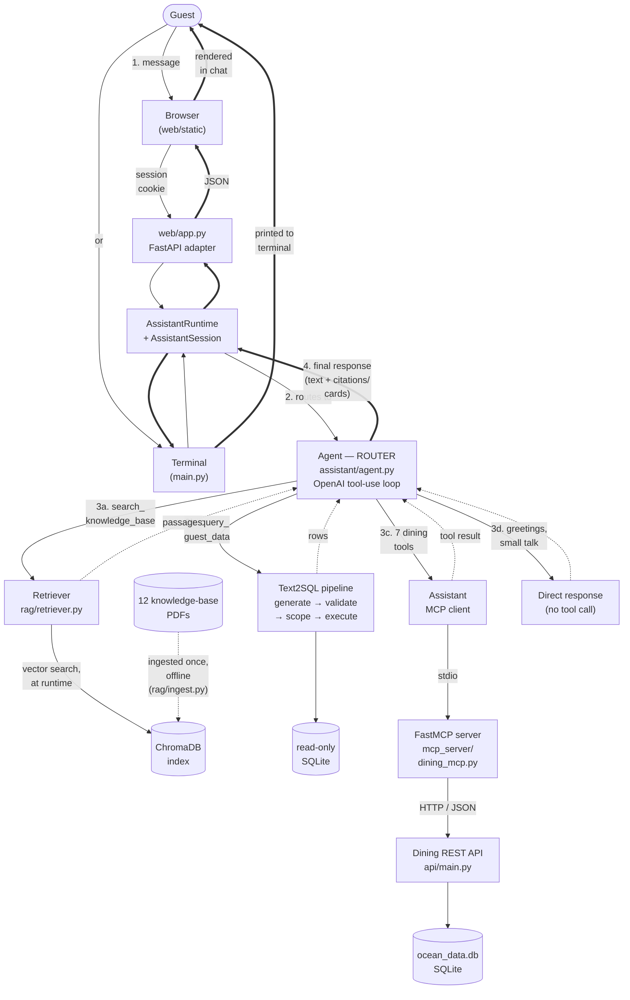
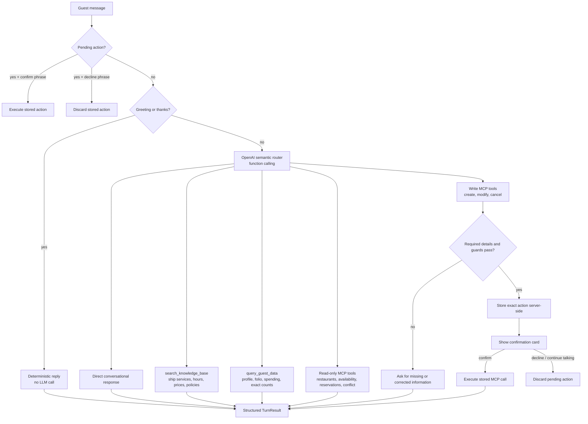
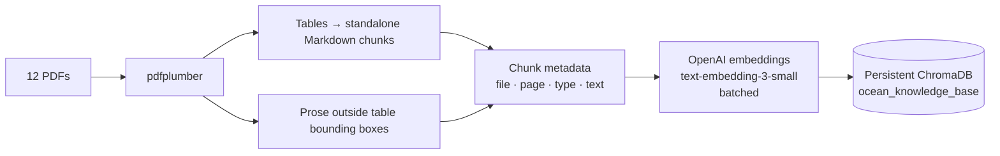
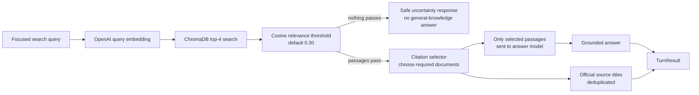
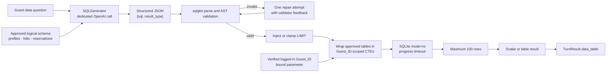
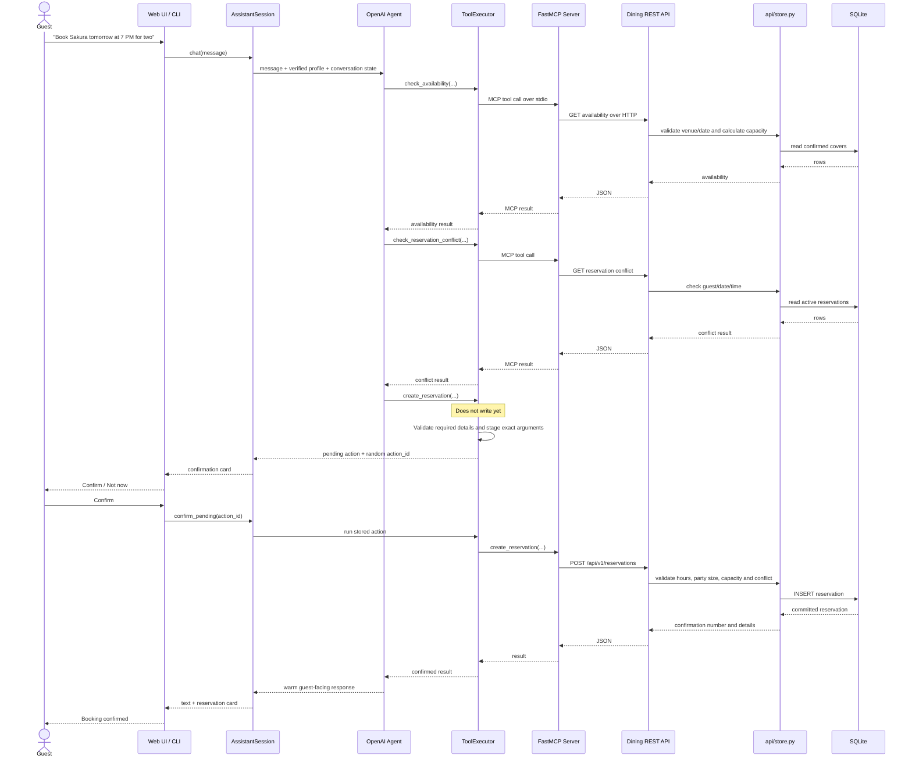
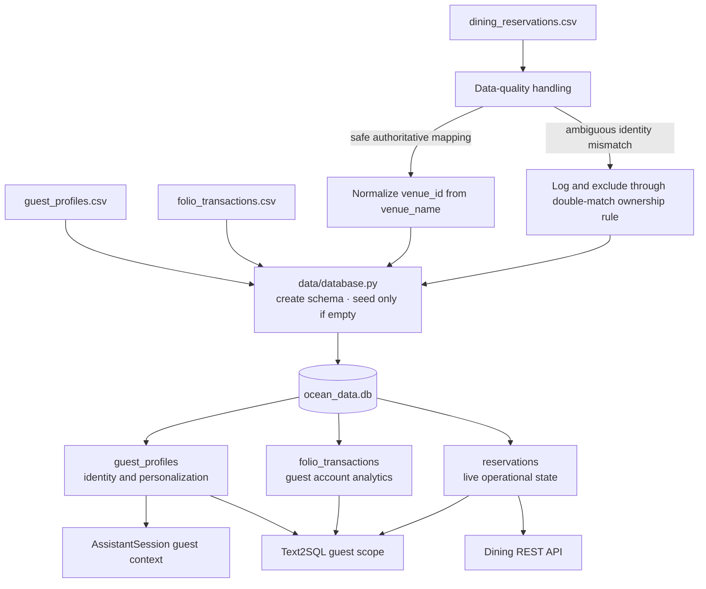
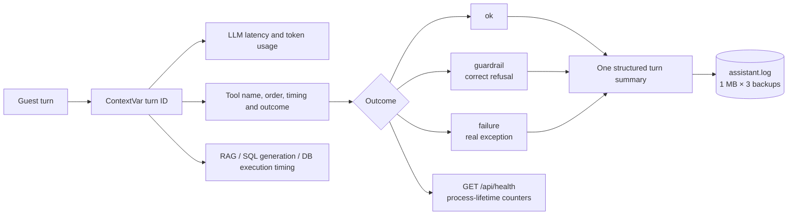

# Ocean Cruises AI Assistant - Architecture & Design

This document presents the system architecture, routing strategy, component responsibilities, MCP and REST API integration, RAG and Text2SQL design, and key security controls for the Ocean Cruises onboard AI assistant.

---
## Table of Contents

- [1. Architecture](#1-architecture)
  - [1.1 Architecture Goals](#11-architecture-goals)
  - [1.2 Architecture Diagram](#12-architecture-diagram)
  - [1.3 How to Read the Architecture Diagram](#13-how-to-read-the-architecture-diagram)
    - [1.3.1 Guest Input and Shared Runtime](#131-guest-input-and-shared-runtime)
    - [1.3.2 Semantic Routing](#132-semantic-routing)
    - [1.3.3 RAG Flow](#133-rag-flow)
    - [1.3.4 Text2SQL Flow](#134-text2sql-flow)
    - [1.3.5 MCP and REST API Connection](#135-mcp-and-rest-api-connection)
    - [1.3.6 Dining Tools](#136-dining-tools)
    - [1.3.7 Response Flow](#137-response-flow)
    - [1.3.8 Architecture Summary](#138-architecture-summary)

- [2. Component Responsibilities](#2-component-responsibilities)

- [3. Routing Strategy](#3-routing-strategy)
  - [3.1 Routing Model](#31-routing-model)
  - [3.2 Routing Matrix](#32-routing-matrix)
  - [3.3 Why Use the LLM as the Semantic Router?](#33-why-use-the-llm-as-the-semantic-router)

- [4. Tool Inventory](#4-tool-inventory)
  - [4.1 Local Tools](#41-local-tools)
  - [4.2 MCP Dining Tools](#42-mcp-dining-tools)

- [5. MCP Server and REST API Connection](#5-mcp-server-and-rest-api-connection)
  - [5.1 Runtime Lifecycle](#51-runtime-lifecycle)
  - [5.2 Why Keep MCP and REST Separate?](#52-why-keep-mcp-and-rest-separate)

- [6. RAG Architecture](#6-rag-architecture)
  - [6.1 Offline Ingestion](#61-offline-ingestion)
  - [6.2 Online Retrieval](#62-online-retrieval)
  - [6.3 Why This RAG Approach?](#63-why-this-rag-approach)

- [7. Text2SQL Architecture](#7-text2sql-architecture)
  - [7.1 Defense in Depth](#71-defense-in-depth)

- [8. Reservation Write and Confirmation Flow](#8-reservation-write-and-confirmation-flow)
  - [8.1 Why Store the Pending Action Server-Side?](#81-why-store-the-pending-action-server-side)

- [9. Data Architecture and Source of Truth](#9-data-architecture-and-source-of-truth)
  - [9.1 Source-of-Truth Rules](#91-source-of-truth-rules)

- [10. Structured Response Architecture](#10-structured-response-architecture)

- [11. Error Handling, Privacy, and Observability](#11-error-handling-privacy-and-observability)
  - [11.1 Error Handling](#111-error-handling)
  - [11.2 Guest Privacy and Authorization](#112-guest-privacy-and-authorization)
  - [11.3 Observability](#113-observability)

---

## 1. Architecture 

### 1.1 Architecture goals

The system was designed around the following goals:
- Give guests one natural-language interface for ship information, personal
  account questions, and dining reservations.
- Route each request automatically without asking the guest to select a tool.
- Keep deterministic business rules outside the LLM.
- Use MCP for dining operations while keeping the REST API independently usable.
- Ground ship-information answers in the supplied PDFs and show official sources.
- Restrict Text2SQL to the logged-in guest’s data.
- Require explicit confirmation before create, modify, or cancel operations.


---

### 1.2 Architecture Diagram



---

### 1.3 How to Read the Architecture Diagram

The diagram shows the complete request and response flow required by the assessment: **guest input → router → capability → response**. The dashed arrows show each capability returning its result to the agent. The thicker arrows show the final structured response moving through the shared runtime to the Web UI or CLI and then back to the guest.

#### 1.3.1 Guest Input and Shared Runtime

A guest can interact with the assistant through either the Web UI or the terminal interface. Both interfaces use the same `AssistantRuntime` and `AssistantSession`, so the core assistant behavior is not duplicated.

The shared session manages the verified guest context, recent conversation history, booking details collected across multiple turns, and any reservation action waiting for confirmation. The Web UI and CLI are mainly responsible for receiving guest input and displaying the final result.

#### 1.3.2 Semantic Routing

One OpenAI function-calling agent acts as the semantic router. It understands the guest’s request and decides which capability should handle it.

For simple messages such as greetings or thanks, the assistant can respond directly. Ship information and policy questions are routed to `search_knowledge_base`. Questions about the logged-in guest’s profile, folio, spending, or reservation totals are routed to `query_guest_data`. Dining-related requests are routed to one or more of the seven tools exposed through MCP.

The agent can also combine multiple capabilities in one turn. For example, a request asking about spa spending and the spa cancellation policy can use both Text2SQL and RAG before producing one response.

#### 1.3.3 RAG Flow

For a knowledge-base question, the agent calls `search_knowledge_base`, which sends the query to the RAG retriever. At runtime, the retriever searches the existing ChromaDB index, applies relevance filtering, and selects the source documents needed for the answer.

The 12 source PDFs are not read for every guest question. They are processed during the offline ingestion step in `rag/ingest.py`. During ingestion, `pdfplumber` extracts the document content, OpenAI creates the embeddings, and the resulting chunks are stored in ChromaDB. The PDFs are read again only when the index needs to be rebuilt.

#### 1.3.4 Text2SQL Flow

For a guest-specific data question, the agent calls `query_guest_data`. The Text2SQL pipeline generates SQL, validates it using `sqlglot`, applies the verified Guest ID in code, and executes the query through a read-only SQLite connection.

This path is used for exact questions such as cabin information, loyalty points, spending totals, transaction summaries, and reservation counts. The generated SQL is treated as untrusted input and is never used for reservation writes.

#### 1.3.5 MCP and REST API Connection

For dining operations, `assistant/tools.py` uses an MCP client that communicates with the FastMCP server over stdio. The FastMCP server is a thin AI-facing adapter. It receives the selected dining tool call and translates it into an HTTP/JSON request to the FastAPI dining REST API. 

The MCP server does not make reservation decisions. The REST API and `api/store.py` own the core dining rules, including restaurant resolution, input validation, operating hours, capacity checks, reservation conflicts, ownership checks, creation, modification, cancellation, and persistence.

The assistant layer separately owns semantic routing, conversation state, verified guest-context propagation, and confirmation safeguards. This keeps responsibilities clear without placing business decisions inside the MCP transport or the LLM.

#### 1.3.6 Dining Tools

The MCP server exposes seven dining tools: `list_restaurants`, `check_availability`, `list_reservations`, `check_reservation_conflict`, `create_reservation`, `modify_reservation`, and `cancel_reservation`.

Read-only tools can execute immediately. State-changing tools are first staged as pending actions. The exact tool name and arguments are stored server-side, and the operation is executed only after the guest explicitly confirms it.

#### 1.3.7 Response Flow

After the selected capability completes, its result is returned to the agent. The agent uses that result to prepare a guest-friendly response.

The final `TurnResult` can contain normal text, source citations, a data table, a reservation card, or a pending confirmation action. The shared runtime returns this structured result to the active interface. The Web UI renders it as chat content, tables, cards, and confirmation controls, while the CLI displays the same result in terminal format.

#### 1.3.8 Architecture Summary

The architecture keeps each responsibility in the appropriate layer. The LLM understands the guest’s intent and coordinates tools. RAG answers questions using the supplied documents. Text2SQL performs protected guest-specific analysis. MCP provides the AI-facing dining tool interface. The REST API and `api/store.py` enforce reservation rules. SQLite stores the live operational data, and the Web UI or CLI presents the final response to the guest.

---

## 2. Component Responsibilities

| Component | Owns | Does not own |
|---|---|---|
| `web/static/*` | Browser interaction and rendering | Routing, business rules, API keys |
| `web/app.py` | HTTP adapter, login, session cookie, chat/action endpoints | LLM prompts, RAG logic, reservation rules |
| `main.py` | Terminal interaction | Separate assistant logic |
| `web/sessions.py` | Token-to-session mapping and idle expiry | Guest authentication policy or conversation logic |
| `assistant/runtime.py` | Shared lifecycle of retriever, Text2SQL service, and MCP subprocess | Per-guest conversation state |
| `assistant/session.py` | Per-guest identity, trivial responses, pending confirmation workflow | Database rules |
| `assistant/agent.py` | Conversation memory and OpenAI function-calling loop | Tool implementation and business validation |
| `assistant/tools.py` | Tool discovery, execution, guest injection, staging, structured artifacts | Restaurant persistence |
| `rag/*` | PDF ingestion, retrieval, thresholding, source selection | Guest account data |
| `text2sql/*` | SQL generation, AST validation, guest scoping, read-only execution | Reservation writes |
| `mcp_server/dining_mcp.py` | Model-facing dining tool contracts and HTTP translation | Reservation business rules |
| `api/main.py` | REST contract, Pydantic validation, HTTP status mapping | LLM behavior |
| `api/store.py` | Dining domain rules and database operations | Chat/session state |
| `data/database.py` | Schema creation, seed-on-empty behavior, safe normalization and data-quality reporting | Guest-facing decisions |
| `assistant/telemetry.py` | Turn IDs, redaction, timings, counters, log rotation | Business logic |

This structure allows one layer to change without rewriting the others. For
example, the Web UI can be replaced by a mobile application without changing
RAG, Text2SQL, MCP tools, or reservation rules.

---

## 3. Routing Strategy

### 3.1 Routing model

The system uses one OpenAI function-calling agent as a **semantic router**.
It receives clear tool descriptions and chooses among:

- a direct response,
- the local RAG tool,
- the local Text2SQL tool,
- one of seven MCP dining tools,
- or a sequence of tools for a mixed request.



### 3.2 Routing matrix

| Intent | Tool or path | Why |
|---|---|---|
| “Hi” or “Thank you” | Deterministic session reply | Faster, cheaper, and fully predictable |
| General ship information | `search_knowledge_base` | Requires grounded evidence from the supplied PDFs |
| Personal profile or account data | `query_guest_data` | Requires exact guest-scoped computation |
| Reservation count or breakdown | `query_guest_data` | SQL gives complete and exact totals; the model does not count rows manually |
| Restaurant catalog | `list_restaurants` | Structured operational data from the dining service |
| Availability | `check_availability` | Capacity is live operational state, not knowledge-base content |
| Reservation details | `list_reservations` | Returns the current persisted reservation records |
| Existing same-time booking | `check_reservation_conflict` | Supports a conflict-only question and prevents accidental double booking |
| New booking | `create_reservation` after confirmation | State change must be explicit |
| Change booking | `modify_reservation` after confirmation | State change and ownership-sensitive |
| Cancel booking | `cancel_reservation` after confirmation | Soft-cancelled, not deleted |
| Mixed personal + policy question | Multiple tool calls | Each part uses its correct source of truth |

### 3.3 Why use the LLM as the semantic router?

A separate keyword classifier would introduce a second interpretation layer
that could disagree with the model producing the answer. Function calling
allows the same model to understand the guest’s wording, select one or more
capabilities, and continue a multi-step request.

The flexible routing is balanced by deterministic controls:

- Missing dates are blocked in Python.
- Party sizes above eight are rejected before staging.
- Restaurant names are resolved deterministically.
- SQL is treated as untrusted and validated structurally.
- Create, modify, and cancel calls are staged rather than immediately run.
- The REST service re-checks operational rules before a write.

---

## 4. Tool inventory

### 4.1 Local tools

| Tool | Implementation | Data source | Used for |
|---|---|---|---|
| `search_knowledge_base` | `assistant/tools.py` → `rag/*` | ChromaDB built from 12 PDFs | Ship information, services, hours, prices, and policies |
| `query_guest_data` | `assistant/tools.py` → `text2sql/*` | Read-only guest-scoped SQLite | Profile, cabin, loyalty, folio, spending, statuses, exact reservation analytics |

### 4.2 MCP dining tools

| MCP tool | REST call | Domain operation |
|---|---|---|
| `list_restaurants` | `GET /api/v1/restaurants` | Return five specialty venues and operational details |
| `check_availability` | `GET /api/v1/restaurants/{venue_id}/availability?date=...` | Capacity and time-slot availability for one venue and date |
| `list_reservations` | `GET /api/v1/reservations` | Filter reservation details by guest, status, dates, or venue |
| `check_reservation_conflict` | `GET /api/v1/reservations/conflict` | Detect an existing active booking at the same date and time |
| `create_reservation` | `POST /api/v1/reservations` | Create a confirmed reservation after guest confirmation |
| `modify_reservation` | `PATCH /api/v1/reservations/{reservation_id}` | Change selected fields after ownership and validation checks |
| `cancel_reservation` | `DELETE /api/v1/reservations/{reservation_id}` | Soft-cancel and retain the record for history |

`check_reservation_conflict` is an additional seventh tool beyond the six
minimum dining operations. It is useful when a guest asks only whether a time
conflicts with an existing reservation, and it also gives the booking flow a
deterministic check before creation.

---

## 5. MCP server and REST API connection

The assistant does not call the dining API directly. It calls MCP tools.

```mermaid
flowchart LR
    AGENT["OpenAI agent<br/>tool call"] --> EXEC["ToolExecutor"]
    EXEC --> CLIENT["MCP ClientSession<br/>mcp package"]
    CLIENT <-->|"JSON-RPC-style MCP messages<br/>over stdin/stdout"| SERVER["FastMCP server<br/>dining_mcp.py"]
    SERVER --> MAP["Tool function<br/>maps arguments to an endpoint"]
    MAP --> HTTPX["Shared httpx.Client<br/>DINING_API_BASE_URL<br/>timeout = 10s"]
    HTTPX -->|"HTTP/JSON"| API["FastAPI dining API<br/>127.0.0.1:8000"]
    API --> PYDANTIC["Pydantic request validation<br/>HTTP error mapping"]
    PYDANTIC --> STORE["api/store.py<br/>business rules"]
    STORE --> DB[("SQLite")]
    DB --> STORE --> API --> HTTPX --> SERVER --> CLIENT --> EXEC --> AGENT
```



### 5.1 Runtime lifecycle

1. `AssistantRuntime.start()` initializes the RAG retriever and Text2SQL service.
2. It starts `mcp_server/dining_mcp.py` as a Python subprocess.
3. It opens an MCP `ClientSession` over stdio and performs MCP initialization.
4. It asks the server for its available tools.
5. `ToolExecutor` converts the discovered MCP schemas into OpenAI function
   specifications and combines them with the two local tools.
6. When the model selects a dining tool, the MCP server converts that call to
   an HTTP request against the dining API.
7. The API calls `api/store.py`, which applies the rules and reads or writes
   SQLite.
8. The result returns through REST → MCP → ToolExecutor → model → guest.

### 5.2 Why keep MCP and REST separate?

- **MCP is the AI-facing contract.** Tool descriptions are written for model
  selection and argument generation.
- **REST is the application-facing contract.** It can later serve a mobile app,
  staff console, kiosk, or another agent.
- **`api/store.py` is the domain source of truth.** Validation is not duplicated
  in every client.
- **The model never talks to the database directly for writes.**


---

## 6. RAG architecture

### 6.1 Offline ingestion



Tables are extracted separately because the source documents contain dense
prices, hours, policies, and schedules. The table bounding boxes are removed
from prose extraction so the same content is not indexed twice.

### 6.2 Online retrieval



### 6.3 Why this RAG approach?

- `pdfplumber` preserves table structure better for this corpus.
- ChromaDB provides a persistent local index that is simple to run.
- A relevance threshold prevents “nearest but irrelevant” passages from being
  treated as evidence.
- Citations are built from retrieved metadata rather than typed freely by the
  model.
- The citation selector avoids displaying extra documents that were retrieved
  but were not needed for the answer.
- Source titles are mapped centrally, keeping filenames, pages, chunk IDs, and
  scores internal.

---

## 7. Text2SQL architecture



### 7.1 Defense in depth

1. The SQL model sees only the approved schema.
2. `sqlglot` parses the query; raw string matching is not the security boundary.
3. Only one `SELECT` statement and approved tables are allowed.
4. Database-qualified names, write operations, dangerous functions, and unsafe
   syntax are rejected.
5. Guest scoping is injected in code with a bound parameter.
6. SQLite is opened read-only.
7. Row count and execution time are bounded.
8. Raw SQL and database errors are not shown to the guest.


---

## 8. Reservation write and confirmation flow



### 8.1 Why store the pending action server-side?

The model proposes the operation, but confirmation executes the exact stored
tool name and arguments. This prevents the operation from changing between
proposal and confirmation. Continuing the conversation clears the stale
pending action, and only one action can be pending at a time.

---

## 9. Data architecture and source of truth



### 9.1 Source-of-truth rules

- Guest profiles are the authoritative source for guest names and profile data.
- The official restaurant catalog is authoritative for venue IDs.
- `api/store.py` is the source of truth for reservation business behavior.
- SQLite is the live operational state after initial seeding.
- CSV files are seed inputs, not the runtime system of record.
- The 12 PDFs are authoritative for guest-facing ship policies and services.

---

## 10. Structured response architecture

The assistant core does not return only a block of prose. It returns a
`TurnResult` with separate fields:

```text
TurnResult
├── text
├── citations[]
├── data_table
├── reservation_card
├── pending_action
└── tools_used
```

This keeps response generation separate from presentation. The Web UI renders
tables, citation chips, reservation cards, and confirmation controls. The CLI
renders the same underlying result using Rich.

Long reservation lists are attached as complete structured tables instead of
asking the model to reproduce every row in prose. This prevents rows from being
silently dropped.

---

## 11. Error handling, privacy, and observability

### 11.1 Error handling

- FastAPI request models validate input shapes and party-size ranges.
- `StoreError` codes map to meaningful HTTP status codes.
- The MCP layer normalizes connection, validation, and unexpected errors.
- The tool executor catches failures and returns a readable tool error.
- The agent rolls back incomplete conversation history after a failed turn.
- The guest receives a friendly message instead of stack traces, SQL, or raw
  internal errors.
- A maximum of eight tool rounds acts as a circuit breaker.

### 11.2 Guest privacy and authorization

- Login resolves a Guest ID from the profile database before a session exists.
- Guest identity is attached to the per-guest `AssistantSession`.
- The tool executor injects the logged-in identity into guest-scoped tool calls.
- Text2SQL scopes all approved tables to the verified Guest ID.
- Reservation actions apply ownership and name-match checks in the normal
  assistant flow.
- Sensitive free text and personal fields are reduced to character counts in
  logs.
- The OpenAI key stays on the server and is never sent to the browser.

### 11.3 Observability



Guardrail rejections are counted separately from genuine failures. A missing
date or an oversized party is a correct safety response, not a broken tool.

---


