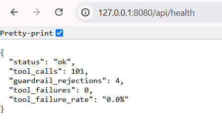

# Ocean Cruises : Onboard AI Assistant

A guest-facing AI assistant for Ocean Cruises. Guests can use one natural conversation to:

- Ask questions about the ship, services, prices, hours, and policies.
- View and manage their specialty dining reservations.
- Ask questions about their own cabin, loyalty points, folio charges, spending, and reservation history.
- Receive clear source citations, confirmation cards, reservation cards, and data tables.

This project includes the two core assessment capabilities: **RAG** and a **REST API with an MCP server**, and also completes the **Text2SQL bonus**.

## Documentation

- [Architecture and System Design](ARCHITECTURE.md)
- [Demo Script and Tested Queries](DEMO_SCRIPT.md)
- [Guest Execution Screenshots](demo_evidence/guest_screenshots/)
- [Observability Evidence](demo_evidence/observability/)

---
## Table of Contents

- [1. Main Capabilities](#1-main-capabilities)
- [2. Project Layout](#2-project-layout)
- [3. Code Map](#3-code-map)
- [4. Technology Stack](#4-technology-stack)

- [5. Setup and Run](#5-setup-and-run)
  - [5.1 Requirements](#51-requirements)
  - [5.2 Open the Project Folder](#52-open-the-project-folder)
  - [5.3 Create and Activate a Virtual Environment](#53-create-and-activate-a-virtual-environment)
    - [5.3.1 Windows PowerShell](#531-windows-powershell)
    - [5.3.2 macOS or Linux](#532-macos-or-linux)
  - [5.4 Install Dependencies](#54-install-dependencies)
  - [5.5 Create the Environment File](#55-create-the-environment-file)
    - [5.5.1 Windows](#551-windows)
    - [5.5.2 macOS or Linux](#552-macos-or-linux)
  - [5.6 Build the RAG Index](#56-build-the-rag-index)
  - [5.7 Start the Dining REST API](#57-start-the-dining-rest-api)
  - [5.8 Start the Web UI](#58-start-the-web-ui)
  - [5.9 Optional Terminal Interface](#59-optional-terminal-interface)
  - [5.10 Reset the Prototype Data](#510-reset-the-prototype-data)

- [6. Key Architecture Choices and Justification](#6-key-architecture-choices-and-justification)

- [7. RAG Design](#7-rag-design)
  - [7.1 Ingestion](#71-ingestion)
  - [7.2 Retrieval and Citations](#72-retrieval-and-citations)

- [8. REST API and MCP Server](#8-rest-api-and-mcp-server)
  - [8.1 REST Endpoints](#81-rest-endpoints)
  - [8.2 MCP Tools](#82-mcp-tools)
  - [8.3 Confirmation Flow](#83-confirmation-flow)

- [9. Text2SQL Bonus](#9-text2sql-bonus)
  - [9.1 Safety Layers](#91-safety-layers)

- [10. Database Inconsistencies](#10-database-inconsistencies)
  - [10.1 Guest-Name Mismatches](#101-guest-name-mismatches)
  - [10.2 Incorrect Venue IDs](#102-incorrect-venue-ids)

- [11. REST API Authorization and Data-Inconsistency Limitation](#11-rest-api-authorization-and-data-inconsistency-limitation)

- [12. Logging, Observability and Tool Failure Rate](#12-logging-observability-and-tool-failure-rate)
  - [12.1 Guardrail Rejections and Tool Failures](#121-guardrail-rejections-and-tool-failures)
  - [12.2 Verified Tool-Failure Metric](#122-verified-tool-failure-metric)

- [13. Automated Testing](#13-automated-testing)
  - [13.1 Offline Tests](#131-offline-tests)
  - [13.2 RAG Retrieval and Citation Tests](#132-rag-retrieval-and-citation-tests)
  - [13.3 Text2SQL Tests](#133-text2sql-tests)
  - [13.4 Web Tests](#134-web-tests)
  - [13.5 Run the Full Suite](#135-run-the-full-suite)

- [14. Prototype Versus Production](#14-prototype-versus-production)

- [15. What I Would Improve With More Time](#15-what-i-would-improve-with-more-time)
  - [15.1 Complete API-Level Authorization and Formal Data-Quality Ingestion](#151-complete-api-level-authorization-and-formal-data-quality-ingestion)
  - [15.2 Add an Immutable Reservation Audit Trail](#152-add-an-immutable-reservation-audit-trail)
  - [15.3 Improve Centralized Observability](#153-improve-centralized-observability)
  - [15.4 Expand Automated Evaluation and CI](#154-expand-automated-evaluation-and-ci)
  - [15.5 Improve RAG Quality](#155-improve-rag-quality)
  - [15.6 Strengthen Human Escalation](#156-strengthen-human-escalation)
  - [15.7 Optimize Model Cost and Latency](#157-optimize-model-cost-and-latency)
  - [15.8 Conduct Broader Production-Level Testing](#158-conduct-broader-production-level-testing)
  - [15.9 Add More Operational MCP Tools](#159-add-more-operational-mcp-tools)
  - [15.10 Add Response Streaming in the Web UI](#1510-add-response-streaming-in-the-web-ui)

---

## 1. Main Capabilities

| Capability | What is implemented |
|---|---|
| Guest identification | Guests log in with a Guest ID that is checked against `guest_profiles.csv`. |
| Automatic routing | The OpenAI agent decides whether to answer directly, use RAG, run Text2SQL, or call dining MCP tools. |
| RAG | Searches 12 PDF knowledge-base documents and returns answers with official source names. |
| Dining REST API | Lists restaurants, checks availability, lists reservations, and creates, modifies, or cancels reservations. |
| MCP server | Exposes seven dining tools and calls the REST API through HTTP. |
| Confirmation before writes | Create, modify, and cancel actions are staged and only executed after explicit guest confirmation. |
| Text2SQL bonus | Answers guest-specific profile, folio, spending, and reservation analytics questions safely. |
| Conversation context | Keeps the six most recent guest turns and a short rolling summary of older conversation history. |
| Structured output | The Web UI renders citations, tables, reservation cards, and confirmation controls. |
| Error handling | Invalid, incomplete, unsafe, unavailable, or ambiguous requests are handled with guest-friendly messages. |
| Observability | Tracks turn IDs, latency, token usage, tools used, guardrail rejections, and genuine tool failures. |
| Automated tests | Includes offline guardrail tests, RAG retrieval tests, citation tests, Text2SQL tests, and Web API tests. |

---

## 2. Project Layout

```text
ocean_assistant/
├── api/                         # Dining REST API and reservation business rules
│   ├── main.py                  # FastAPI endpoints and request handling
│   └── store.py                 # Validation, availability, capacity, and persistence
│
├── assistant/                   # Core conversational assistant
│   ├── agent.py                 # OpenAI tool-calling loop and conversation memory
│   ├── guests.py                # Guest identification and profile lookup
│   ├── prompts.py               # System prompt and assistant instructions
│   ├── runtime.py               # Shared runtime and MCP subprocess lifecycle
│   ├── session.py               # Per-guest sessions and confirmation handling
│   ├── telemetry.py             # Logging, metrics, and tool-failure tracking
│   └── tools.py                 # Tool definitions, execution, and staged actions
│
├── data/                        # Seed data and shared database layer
│   ├── database.py              # SQLite creation, seeding, and normalization
│   ├── dining_reservations.csv  # Reservation seed data
│   ├── folio_transactions.csv   # Folio transaction seed data
│   ├── guest_profiles.csv       # Guest profile seed data
│   └── schema_reference.sql     # Reference database schema
│
├── demo_evidence/               # Screenshot evidence from tested workflows
│   ├── guest_screenshots/
│   │   ├── barbara_martinez/
│   │   ├── michael_williams/
│   │   └── susan_jones/
│   └── observability/
│       └── tool_failure_rate.png
│
├── knowledge_base/              # 12 supplied PDF knowledge-base documents
│
├── mcp_server/
│   └── dining_mcp.py            # FastMCP dining tools and REST API calls
│
├── rag/                         # Retrieval-Augmented Generation pipeline
│   ├── citation_selector.py     # Selects relevant guest-facing citations
│   ├── ingest.py                # Extracts PDFs and builds the ChromaDB index
│   ├── retriever.py             # Semantic retrieval and relevance filtering
│   └── source_names.py          # Maps files to official source names
│
├── tests/                       # Automated test suites
│   ├── test_citations.py
│   ├── test_guardrails_e2e.py
│   ├── test_offline.py
│   ├── test_retrieval.py
│   ├── test_text2sql_guardrails.py
│   ├── test_text2sql_integration.py
│   └── test_web.py
│
├── text2sql/                    # Guest-scoped Text2SQL pipeline
│   ├── executor.py              # Read-only execution and guest scoping
│   ├── generator.py             # SQL generation
│   ├── schema.py                # Approved Text2SQL schema
│   ├── service.py               # Text2SQL orchestration
│   └── validator.py             # SQL parsing and safety validation
│
├── web/                         # Web application and browser interface
│   ├── app.py                   # FastAPI web adapter and endpoints
│   ├── models.py                # Web request and response models
│   ├── sessions.py              # Web session storage
│   └── static/
│       ├── app.js               # Browser behavior and API calls
│       ├── index.html           # Guest interface
│       └── styles.css            # UI styling
│
├── .env.example                 # Example environment configuration
├── .gitignore                   # Files excluded from Git
├── ARCHITECTURE.md              # Detailed architecture and design
├── DEMO_SCRIPT.md               # Verified demo queries and capabilities
├── README.md                    # Project overview, setup, and documentation
├── config.py                    # Environment-based application settings
├── main.py                      # Terminal chat interface
├── pytest.ini                   # Pytest configuration
└── requirements.txt             # Python dependencies
```

---

## 3. Code Map

| Concern | Primary Files |
|---|---|
| Web application startup, lifecycle, and API endpoints | `web/app.py` |
| Web request and response models | `web/models.py` |
| Web session management | `web/sessions.py` |
| Browser interface and structured response rendering | `web/static/index.html`, `web/static/app.js`, `web/static/styles.css` |
| Terminal chat interface | `main.py` |
| Shared assistant runtime and MCP server startup | `assistant/runtime.py` |
| Per-guest session and confirmation handling | `assistant/session.py` |
| Agent loop, semantic routing, and conversation memory | `assistant/agent.py` |
| Tool definitions, execution, staged actions, and structured results | `assistant/tools.py` |
| Guest identification and profile lookup | `assistant/guests.py` |
| System prompt and assistant instructions | `assistant/prompts.py` |
| Logging, telemetry, guardrail tracking, and failure metrics | `assistant/telemetry.py` |
| MCP dining tools and REST API communication | `mcp_server/dining_mcp.py` |
| Dining REST API endpoints | `api/main.py` |
| Reservation validation and business rules | `api/store.py` |
| SQLite database creation, seeding, normalization, and access | `data/database.py` |
| Reference database schema | `data/schema_reference.sql` |
| Guest profile seed data | `data/guest_profiles.csv` |
| Folio transaction seed data | `data/folio_transactions.csv` |
| Dining reservation seed data | `data/dining_reservations.csv` |
| RAG document ingestion and ChromaDB index creation | `rag/ingest.py` |
| RAG semantic retrieval and relevance filtering | `rag/retriever.py` |
| Citation selection | `rag/citation_selector.py` |
| Official knowledge-base source-name mapping | `rag/source_names.py` |
| Text2SQL approved schema | `text2sql/schema.py` |
| Text2SQL generation | `text2sql/generator.py` |
| Text2SQL validation and SQL guardrails | `text2sql/validator.py` |
| Guest-scoped, read-only SQL execution | `text2sql/executor.py` |
| Text2SQL orchestration | `text2sql/service.py` |
| Application and environment configuration | `config.py`, `.env.example` |
| Pytest configuration | `pytest.ini` |
| Offline and business-rule tests | `tests/test_offline.py` |
| End-to-end guardrail tests | `tests/test_guardrails_e2e.py` |
| RAG retrieval tests | `tests/test_retrieval.py` |
| Citation tests | `tests/test_citations.py` |
| Text2SQL guardrail tests | `tests/test_text2sql_guardrails.py` |
| Text2SQL integration tests | `tests/test_text2sql_integration.py` |
| Web application tests | `tests/test_web.py` |
| Architecture and design documentation | `ARCHITECTURE.md` |
| Verified demo queries and tested capabilities | `DEMO_SCRIPT.md` |
| Guest execution screenshots | `demo_evidence/guest_screenshots/` |
| Tool-failure-rate evidence | `demo_evidence/observability/tool_failure_rate.png` |

---
 ## 4. Technology stack

| Layer | Technology | Purpose |
|---|---|---|
| Language | Python 3.11+ | Core application, API, MCP, RAG, Text2SQL, tests |
| Web UI | Vanilla HTML, CSS, JavaScript | Lightweight guest interface with no frontend build step |
| Web adapter | FastAPI, Pydantic, Uvicorn | Login, chat, confirmation, logout, health endpoints |
| Terminal UI | Rich | Formatted CLI chat, citations, and data tables |
| Agent | OpenAI Python SDK, `AsyncOpenAI` | Function calling, semantic routing, response generation |
| Default chat model | `gpt-4o-mini` | Routing and conversational response generation |
| Embeddings | `text-embedding-3-small` | Knowledge-base chunk and query embeddings |
| MCP | MCP Python SDK, FastMCP | AI-facing dining tool interface |
| MCP transport | stdio | Local subprocess communication between assistant and MCP server |
| MCP-to-API client | `httpx` | HTTP/JSON calls from FastMCP tools to the dining API |
| Dining API | FastAPI, Pydantic, Uvicorn | Deterministic reservation endpoints and validation |
| Domain logic | Plain Python in `api/store.py` | Restaurant mapping, capacity, conflicts, ownership, persistence |
| Operational database | SQLite | Guest profiles, folio transactions, and reservations |
| RAG extraction | `pdfplumber` | Table-aware extraction from 12 supplied PDFs |
| Vector store | ChromaDB | Persistent semantic index |
| SQL parsing | `sqlglot` | AST-level Text2SQL validation and rewriting |
| Configuration | `python-dotenv` | Environment-driven models, paths, API URL, and thresholds |
| Observability | Python logging, `contextvars`, rotating file handler | Turn IDs, timing, tokens, tools, guardrails, failures |
| Testing | `pytest`, `pytest-asyncio` | Offline, retrieval, citations, Text2SQL, web, and E2E guardrail tests |

---


## 5. Setup and Run

### 5.1 Requirements

Before starting, make sure you have:

- Python 3.11 or newer
- An OpenAI API key
- Two PowerShell or terminal windows

### 5.2 Open the project folder

```powershell
cd C:\path\to\ocean_assistant
```

### 5.3 Create and activate a virtual environment

#### 5.3.1 Windows PowerShell

```powershell
python -m venv venv
venv\Scripts\Activate.ps1
```

If PowerShell blocks activation, run this once in the same window:

```powershell
Set-ExecutionPolicy -Scope Process -ExecutionPolicy Bypass
venv\Scripts\Activate.ps1
```

#### 5.3.2 macOS or Linux

```bash
python3 -m venv venv
source venv/bin/activate
```

### 5.4 Install dependencies

```powershell
python -m pip install -r requirements.txt
```

### 5.5 Create the environment file

#### 5.5.1 Windows

```powershell
Copy-Item .env.example .env
notepad .env
```

#### 5.5.2 macOS or Linux

```bash
cp .env.example .env
```

Add your OpenAI key:

```env
OPENAI_API_KEY=your-key-here
```

The main optional settings are:

```env
OPENAI_CHAT_MODEL=gpt-4o-mini
OPENAI_SQL_MODEL=gpt-4o-mini
OPENAI_EMBEDDING_MODEL=text-embedding-3-small
DINING_API_BASE_URL=http://127.0.0.1:8000
ASSISTANT_TODAY=2026-02-07
RAG_MIN_RELEVANCE=0.30
```

`ASSISTANT_TODAY` is set inside the sample sailing window so phrases such as “tonight” and “tomorrow” work with the provided data.

### 5.6 Build the RAG index

Run this once before starting the assistant, and again whenever the knowledge-base PDFs change:

```powershell
python rag/ingest.py
```

This extracts tables and prose from all 12 PDFs, creates embeddings, and stores the index in `chroma_db/`.

### 5.7 Start the dining REST API

Open the first terminal, activate the virtual environment, and run:

```powershell
python -m uvicorn api.main:app --port 8000
```

The API creates `ocean_data.db` and seeds it from the three CSV files only when the database tables are empty.

API documentation is available at:

```text
http://127.0.0.1:8000/docs
```

### 5.8 Start the Web UI

Open the second terminal, activate the same virtual environment, and run:

```powershell
python -m uvicorn web.app:app --port 8080
```

Open:

```text
http://127.0.0.1:8080
```

The MCP server starts automatically as a stdio subprocess. It does not need a third terminal.

### 5.9 Optional terminal interface

Instead of the Web UI, the same assistant can be used from the command line:

```powershell
python main.py
```

Both interfaces use the same assistant runtime, tools, guest rules, and data.

### 5.10 Reset the Prototype Data

To return reservations to their original CSV state:

1. Stop the REST API.
2. Delete `ocean_data.db`.
3. Start the REST API again.

Windows PowerShell:

```powershell
Remove-Item .\ocean_data.db
python -m uvicorn api.main:app --port 8000
```

---

## 6. Key Architecture Choices and Justification


| Decision | Why I chose it | Trade-off |
|---|---|---|
| Built the agent loop directly | The tool loop is small, visible, and easy to debug. It avoids unnecessary LangChain or LlamaIndex abstractions for this project size. | More orchestration code can be maintained directly. |
| Used the LLM as the router | Tool selection naturally handles unclear, follow-up, and multi-tool questions. | Routing quality depends on clear tool descriptions, prompts, and code-side guardrails. |
| Kept MCP thin and REST API focused on business logic | MCP gives the AI a clean tool interface, while FastAPI handles validation, capacity, persistence, and structured errors. The API can also be tested independently. | It adds one HTTP boundary between MCP and the reservation store. |
| Used real MCP over stdio | Demonstrates the actual protocol instead of importing Python functions directly. The assistant starts the server automatically. | Subprocess management adds a small amount of complexity. |
| Used one SQLite database | It is portable, persistent, simple to review, and lets Text2SQL read live reservation changes. | It is not designed for high-concurrency production booking traffic. |
| Used ChromaDB | It provides local persistent vector search and metadata support with no external infrastructure. | A production system may need a managed or shared vector store. |
| Used `pdfplumber` | The source PDFs contain many tables. Tables are extracted separately as Markdown so prices, hours, and policies keep their row structure. | Table-aware ingestion requires more custom code than basic text extraction. |
| Used `gpt-4o-mini` for routing and response generation | Provides reliable tool calling, structured outputs, low latency, and reasonable cost for this prototype. | In production, I would use model tiering: a smaller model for routine requests and a stronger model only for complex multi-tool reasoning. |
| Used `text-embedding-3-small` for RAG embeddings | It is fast, cost-effective, and sufficient for the small 12-document knowledge base. | In production, I would benchmark multiple embedding models and select one based on retrieval accuracy, latency, and cost. |
| Used `sqlglot` for Text2SQL validation | SQL is parsed as an abstract syntax tree instead of being checked with simple string matching. This makes it possible to enforce SELECT-only queries, approved tables, and row limits. | AST validation adds implementation complexity. In production, I would also use a dedicated read-only database user, database-level row security, query budgets, and audit logging. |
| Used FastAPI for the web adapter and dining REST API | FastAPI provides request validation, async support, clear endpoint definitions, and automatic API documentation. | In production, the services would be containerized, deployed behind a load balancer, and protected with authentication and rate limiting. |
| Used httpx between the MCP server and REST API | It keeps the MCP server as a thin adapter and provides clear HTTP timeouts and structured API communication. | The extra HTTP boundary adds a small amount of latency. In production, I would add retries, circuit breakers, and service authentication, |
| Stage state-changing actions server-side | The exact action is stored before confirmation. The model cannot silently change the arguments after the guest confirms. | The application must manage pending-action state. |
| Keep recent turns plus a rolling summary | Preserves useful context while controlling prompt size and token cost. | Older conversation details are summarized rather than kept word-for-word. |

---

## 7. RAG Design

The RAG pipeline covers all 12 supplied PDF documents.

### 7.1 Ingestion

- Uses `pdfplumber` to extract tables and prose separately.
- Stores each detected table as its own Markdown chunk.
- Removes table areas from prose extraction so the same content is not indexed twice.
- Uses approximately 2,800 characters per prose chunk with a 300-character overlap.
- Stores source filename, official source name, page number, and chunk type as metadata.
- Uses OpenAI embeddings and a persistent ChromaDB collection.
- Rebuilding the index deletes and recreates the collection, making ingestion repeatable.

### 7.2 Retrieval and citations

- Retrieves the top four semantic matches.
- Converts cosine distance into a relevance score.
- Removes chunks below `RAG_MIN_RELEVANCE`, which defaults to `0.30`.
- Returns a safe fallback when no passage is strong enough.
- Uses a small citation-selection step only when more than one document is retrieved.
- Shows only official document titles to the guest.
- Does not show filenames, page numbers, chunk IDs, similarity scores, or raw passages.
- The current implementation is semantic vector retrieval.


---

## 8 REST API and MCP Server

The dining API is the system of record for restaurant information and reservation state. The MCP server is a thin tool layer that calls this API through `httpx`.

### 8.1 REST endpoints

| Method | Endpoint | Purpose |
|---|---|---|
| `GET` | `/api/v1/restaurants` | List specialty restaurants |
| `GET` | `/api/v1/restaurants/{venue_id}/availability` | Check capacity and seating slots for a date |
| `GET` | `/api/v1/reservations` | List and filter reservations |
| `GET` | `/api/v1/reservations/conflict` | Check whether the guest already has a reservation at the same time |
| `POST` | `/api/v1/reservations` | Create a reservation |
| `PATCH` | `/api/v1/reservations/{reservation_id}` | Modify a reservation |
| `DELETE` | `/api/v1/reservations/{reservation_id}` | Soft-cancel a reservation |

The API validates restaurant references, dates, opening hours, party size, capacity, allowed modification fields, cancellation state, and reservation ownership when an acting guest is supplied.

### 8.2 MCP tools

The six required tools are implemented:

1. `list_restaurants`
2. `check_availability`
3. `list_reservations`
4. `create_reservation`
5. `modify_reservation`
6. `cancel_reservation`

An additional seventh tool is included:

7. `check_reservation_conflict`

`check_reservation_conflict` is useful when a guest only wants to know whether a proposed time conflicts with an existing reservation. It also gives the assistant a deterministic read-only check before staging a new booking, instead of waiting for a create request to fail later.

### 8.3 Confirmation flow

Create, modify, and cancel tools do not immediately change the database.

1. The assistant collects and validates the request.
2. The exact action and arguments are stored under a random action ID.
3. The guest sees the proposed action and must confirm or decline it.
4. Only an explicit confirmation executes the stored action.
5. Continuing with a different conversation clears the old pending action.

This protects against accidental bookings, stale confirmations, double narration, and model-generated changes after confirmation.

---

## 9. Text2SQL Bonus

The Text2SQL bonus is implemented for questions about the logged-in guest's:

- Profile and cabin
- Loyalty tier and points
- Folio charges and spending
- Posted, pending, disputed, or refunded transactions
- Reservation counts, totals, date ranges, and breakdowns

Generated SQL is treated as untrusted input.

### 9.1 Safety layers

1. A dedicated SQL-generation call sees only the approved schema.
2. `sqlglot` parses and validates the SQL syntax tree.
3. Only one `SELECT` or `UNION` query is allowed.
4. Only three approved logical tables are allowed.
5. Write operations, DDL, PRAGMA, ATTACH, database-qualified names, unsafe functions, and model-created CTEs are rejected.
6. A code-generated wrapper limits every table to the verified guest.
7. Reservation rows also follow the guest-name consistency rule.
8. SQL runs through a read-only SQLite connection.
9. Results are limited to 100 rows with a five-second execution guard.
10. One correction attempt is allowed when generated SQL is invalid.
11. Raw SQL and database errors are never shown to the guest.

This provides defense in depth instead of relying only on the model prompt.

---

## 10 Database Inconsistencies

The provided `dining_reservations.csv` contains two different data-quality problems. They are handled differently because the confidence level is different.

### 10.1 Guest-name mismatches

Five reservation rows contain a `Guest_Name` that does not match the profile name for the same `Guest_ID`.

The prototype does not guess which field is correct. A reservation is treated as belonging to the logged-in guest only when both conditions are true:

- The stored `guest_id` matches the logged-in Guest ID.
- The stored `guest_name` matches the name in `guest_profiles.csv`.

This double-match rule is applied when listing reservations, running reservation Text2SQL queries, and staging modify or cancel actions. An unclear row is hidden from the guest and cannot be changed through the assistant. The mismatches are also logged at startup for operator review.

If a guest believes a missing reservation should exist, the assistant explains that it cannot see the reservation and recommends Guest Services on Deck 5 for verification instead of making a guess.

### 10.2 Incorrect venue IDs

The same CSV has 138 of 212 rows where the venue ID does not match the official five-restaurant catalog. In this case, the venue name is consistent and the official catalog provides a safe source of truth.

During database seeding, the application:

- Uses `venue_name` to map each row to the official venue ID.
- Corrects the inconsistent IDs before inserting them into SQLite.
- Logs how many rows were normalized.
- Resolves a restaurant name or ID deterministically in the assistant tool layer before the normal API call, while the API validates the reference against the shared catalog.

The model therefore does not need to remember the venue mapping, reducing the risk of booking the wrong restaurant.

The general rule is : automatically correct data only when an authoritative source makes the correction safe. When the correct value is unclear, flag and exclude the record instead of guessing.

---

## 11. REST API Authorization and Data-Inconsistency Limitation

In this prototype, guest authorization is enforced mainly through the assistant and MCP layers. The logged-in guest’s identity is verified from `guest_profiles.csv`, and the assistant injects that identity into reservation requests before calling the REST API. The API itself remains intentionally lightweight, so the acting `guest_id` is not yet mandatory for every modify or cancel request.

This is also connected to a known data-inconsistency issue in `dining_reservations.csv`: a small number of rows contain a `Guest_Name` that does not match the profile associated with the stored `Guest_ID`. To avoid making an unsafe assumption about whether the ID or the name is incorrect, the prototype uses a conservative ownership rule at the assistant layer and excludes ambiguous rows from guest-facing operations.

With provided more time, I would move these protections fully into the API and ingestion pipeline. During ingestion, inconsistent identity records would be flagged and quarantined for data-quality review instead of entering the operational database. The API would then obtain the guest identity from an authenticated session or token, require that identity for every modify and cancel operation, and verify reservation ownership before making any change. For new reservations, the API would derive the guest name and cabin number directly from the verified `guest_profiles.csv` rather than trusting client-supplied values.

This would make the REST API independently secure for additional clients, while keeping identity validation and authorization consistent across the assistant, MCP, API, and database layers.

---

## 12. Logging, Observability and Tool Failure Rate

The Web application writes rotating operational logs to:

```text
assistant.log
```

Each guest turn receives a short turn ID. The same ID is added to log lines across the assistant and tool execution path.

The turn summary records:

- Total response time
- LLM time and number of model calls
- Input and output token counts
- Tools called and their order
- RAG, Text2SQL, database, and tool timings
- Guardrail rejections
- Genuine failures

Logs rotate at approximately 1 MB and keep three backup files:

```text
assistant.log
assistant.log.1
assistant.log.2
assistant.log.3
```

Tool arguments are redacted before logging. Operational identifiers, venues, dates, times, and party sizes may be logged, while guest names, dietary details, special requests, and free-text questions are reduced to character-count placeholders.

### 12.1 Guardrail rejections and Tool failures

Every tool call is classified as one of three outcomes:

- `ok` — the tool completed successfully.
- `guardrail` — the system correctly blocked an invalid or unsafe request.
- `failure` — the tool actually broke or raised an unexpected exception.

The tool failure rate is calculated using unexpected tool failures only. Guardrail rejections are reported separately and are not counted as system failures.

Open the health endpoint while the Web app is running:

```text
http://127.0.0.1:8080/api/health
```

Example response:

```json
{
  "status": "ok",
  "tool_calls": 54,
  "guardrail_rejections": 8,
  "tool_failures": 0,
  "tool_failure_rate": "0.0%"
}
```
### 12.2 Verified Tool-Failure Metric

The health endpoint was tested after running the demonstrated guest workflows. It recorded 101 tool calls with a 0.00% tool failure rate, while also reporting guardrail rejections and overall tool activity.

Guardrail rejections are tracked separately from tool failures because rejecting an invalid, incomplete, unsafe, or unauthorized request means the safety controls are working correctly.



[Open the full-size observability screenshot](demo_evidence/observability/tool_failure_rate.png)

To view logs in PowerShell:

```powershell
Get-Content .\assistant.log -Tail 20
```

To watch new entries:

```powershell
Get-Content .\assistant.log -Wait
```

The dining API also writes request method, path, status code, and latency to the terminal running port `8000`.


---

## 13. Automated Testing

### 13.1 Offline tests

These do not require an OpenAI key after dependencies are installed:

```powershell
pytest -m "not retrieval and not text2sql and not web" -v
```

They cover business rules, persistence, SQL guardrails, guest scoping, table-aware chunking, confirmation behavior, conflicts, privacy, long reservation lists, and venue resolution.

### 13.2 RAG retrieval and citation tests

Requires an OpenAI key and a built ChromaDB index:

```powershell
pytest tests\test_retrieval.py tests\test_citations.py -v
```

The retrieval suite includes one golden question for each knowledge-base document and off-topic questions that should return no accepted passages.

### 13.3 Text2SQL tests

Requires an OpenAI key and the seeded database:

```powershell
pytest tests\test_text2sql_integration.py tests\test_text2sql_guardrails.py -v
```

The integration suite compares executed results with expected guest-specific answers instead of comparing SQL strings.

### 13.4 Web tests

```powershell
pytest tests\test_web.py -v
```

These cover login validation, session cookies, simple chat requests, and logout behavior.

### 13.5 Run the full suite

```powershell
pytest -v
```

---

## 14 Prototype Versus Production

I made this prototype choices to keep the project easy to run, review, and demonstrate within the assessment timeline. A production system would require stronger infrastructure and controls.

| Area | Current prototype | Production approach | Justification |
|---|---|---|---|
| Guest authentication | Guest ID checked against a local profile CSV | Cruise-app SSO, signed tokens, session expiry, revocation, and role controls | Real identity integration is more secure but depends on enterprise systems and takes longer to integrate and test. |
| API authorization | Verified identity is injected by the assistant/MCP path; direct API identity is not yet mandatory on every write | Mandatory authenticated identity and ownership checks at every API endpoint | Adds important security but requires auth middleware, identity propagation, and migration of existing clients. |
| Data quality | Safe venue corrections at seed time; unclear name mismatches are logged and excluded | Validation pipeline, referential checks, quarantine table, review workflow, and data-quality alerts | Prevents bad data from entering production, but needs operational ownership and monitoring. |
| Database | Local SQLite | Managed PostgreSQL with constraints, transactions, row-level security, connection pooling, backups, and recovery | Higher reliability and concurrency, but adds hosting cost and operational work. |
| Reservation concurrency | Capacity checks are suitable for a local prototype | Transactional checks, row locking, idempotency, and concurrency testing | Prevents race conditions and duplicate bookings, but requires a stronger database and more test effort. |
| Session state | In-memory, single-process sessions with one-hour idle expiry | Redis or another shared session store behind multiple application instances | Enables horizontal scaling, but adds infrastructure and failure modes. |
| RAG store | Local ChromaDB | Shared or managed vector store with document versioning and controlled ingestion | Improves availability and governance, but adds service cost and deployment complexity. |
| Observability | Rotating local logs, turn metrics, and health counters | Central logs, metrics dashboards, distributed traces, alerts, and privacy monitoring | Faster incident response, but requires an observability platform and ongoing maintenance. |
| Reservation audit | Operational logs | Append-only audit events containing actor, before/after values, confirmation, channel, trace ID, and outcome | Important for compliance and support investigations, but needs durable storage and retention rules. |
| Reliability | Friendly fallbacks and bounded tool loops | Timeouts, retries, circuit breakers, service health checks, failover, and graceful degradation | Better uptime, but needs more engineering and dependency testing. |
| Model usage | One configured chat model plus an embedding model | Smaller task-specific models, caching, fallbacks, quality gates, and cost tracking per completed task | Can lower cost and latency, but requires evaluation to avoid reducing accuracy. |
| Evaluation | Local pytest suites | CI evaluation on every change, quality dashboards, regression gates, and adversarial test sets | Prevents silent quality loss, but adds test-data maintenance and model-call cost. |
| Deployment | Two local processes | Containers, secrets manager, load balancer, managed database, autoscaling, and controlled releases | Provides repeatable deployment and scale, but adds cloud cost and operational ownership. |

---

## 15 What I Would Improve With More Time

With additional time, I would focus on strengthening production readiness, reliability, security, and evaluation rather than adding unrelated features.

### 15.1 Complete API-level authorization and formal data-quality ingestion

I would move verified identity and ownership checks fully into the REST API and stop trusting client-supplied guest details. I would also validate incoming records, normalize only safe values, and quarantine unclear identity mismatches for review.

### 15.2 Add an immutable reservation audit trail

Every create, modify, and cancel action would record the verified actor, old and new values, confirmation status, timestamp, channel, trace ID, and final outcome. These events would be append-only and stored separately from normal debugging logs.

### 15.3 Improve centralized observability

I would send structured logs and metrics to a central platform, add dashboards for latency and tool outcomes, and alert on genuine failures, privacy violations, database contention, and unusual RAG or Text2SQL rejection rates.

### 15.4 Expand automated evaluation and CI

I would run RAG, citation, Text2SQL, privacy, confirmation, prompt-injection, and reservation regression tests on every code change. I would also add concurrent booking and double-click confirmation scenarios.

### 15.5 Improve RAG quality

The current pipeline already has table-aware ingestion, semantic retrieval, relevance filtering, and source selection. I would add hybrid keyword and semantic retrieval, more domain metadata filters, a lightweight reranker, follow-up query rewriting, automatic threshold calibration, document version tracking.


### 15.6 Strengthen human escalation

Instead of only recommending Guest Services, the assistant could create a structured support case containing a guest-safe summary, reservation or transaction reference, actions already attempted, reason for escalation, and trace ID. Ambiguous data, disputed charges, medical concerns, and unresolved conflicts could then reach the correct team with useful context.

### 15.7 Optimize model cost and latency

I would test smaller models for routing, SQL generation, and citation selection; cache repeated embeddings and common questions; shorten tool schemas; and track cost per capability and per successfully completed guest task. Model changes would be accepted only after passing the evaluation suite.

### 15.8 Conduct broader production level testing

With more time, I would add load, security, concurrency, outage, and recovery testing to validate the system under real production conditions. This would include concurrent booking tests, API authorization checks, prompt-injection testing, dependency-failure simulations, and database recovery validation.

### 15.9 Add more operational MCP tools

The current seven dining tools cover the assessment scope. Useful next tools would include:

- `suggest_alternative_seatings` — return nearby times or restaurants when the requested slot is unavailable.
- `manage_dining_waitlist` — join, view, or leave a waitlist with confirmation.
- `create_guest_services_case` — hand an unresolved issue to a human team with a safe structured summary and trace ID.

These tools would add real guest value while keeping decisions and writes behind deterministic APIs.

### 15.10 Add response streaming in the Web UI

I would implement streaming responses in the Web UI so guests can see answers appear progressively instead of waiting for the complete response. This would improve perceived responsiveness and provide a smoother conversational experience, especially for longer RAG and Text2SQL responses.

---

